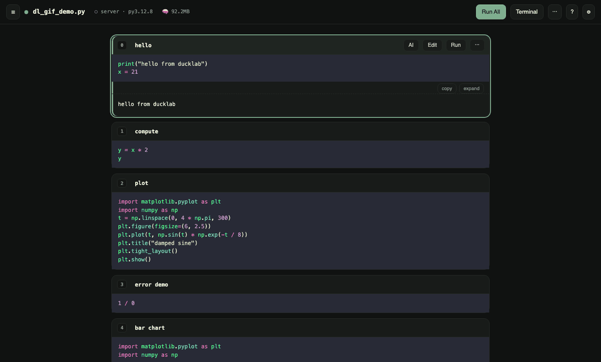

# 🦆 ducklab

**Watch your AI do research.** Plain `.py` files rendered as live notebook cells —
your agent edits the file, the browser updates instantly, and you watch (or jump in)
from any screen, phone included.

```bash
uv run ducklab ~/my/research        # a directory, or a single .py file
# → http://127.0.0.1:8787
```

No `.ipynb`. No cloud. One kernel per file. Claude Code (or any CLI agent) is a
first-class pair partner, side by side with the notebook.

---

### Pair, side by side

Dock the terminal beside the cells: the agent edits the file on the right, and the
new cell lands and scrolls into view on the left — no refresh, no babysitting.


### Point at a cell, tell the AI

Every cell has an **AI** button: type one line and it lands in the agent's terminal
*with the cell's index and title attached* — no re-describing what you're looking at.


### Run and watch

Run All fills a progress bar and follows the running cell; each cell gets a status
stripe (green ok · red error), an elapsed badge, and live kernel-memory in the bar.



---

## Why

| | Jupyter | marimo | hosted AI notebooks | **ducklab** |
|---|---|---|---|---|
| Source format | `.ipynb` JSON | `.py` | proprietary | **plain `.py` + `# %%`** |
| AI edits the file → UI updates | — | partial | n/a | **yes, live** |
| Your agent (Claude Code, codex, …) | bolt-on | — | their AI only | **built in, side by side, context-fed** |
| Data stays local | yes | yes | no | **yes** |
| Isolation | kernel per notebook | — | — | **kernel per file** |

The gap ducklab fills: *"my agent is editing research code — I want to watch cells
and plots update live, poke a cell, and answer from my phone, without babysitting a
notebook."*

## Features

**Notebook**
- **Live cells from plain `.py`** — `# %%` percent format (jupytext/VS Code
  compatible). Disk edits re-render instantly; unchanged cells keep their outputs
  (content-hash identity).
- **In-browser editing** — CodeMirror per cell, editable **title** and source;
  `⌘/Ctrl+S` saves, `⌘/Ctrl+Enter` runs. Saves rewrite only that cell's span, so a
  browser edit and an agent's file edit are the same path — *the file is the truth*.
- **Full cell ops** — run, insert above/below, duplicate, move up/down, clear
  output, delete — from a per-cell **⋯** menu, the bottom **+ Add cell**, or the
  keyboard. **Undo** (`⌘/Ctrl+Z` or the toast) brings back a deleted cell or cleared
  output.
- **Jupyter-style shortcuts** — `j/k` select, `Enter` edit, `Shift+Enter` run &
  advance, `a/b` insert, `dd` delete; `?` shows the full list.
- **Run feedback** — per-cell status stripe (ok/error) and **elapsed** badge, an
  **edited** badge when a cell changed since its last run, Run-All progress bar, live
  **kernel memory** in the top bar.

**Agent pairing**
- **Agent built in** — the embedded terminal auto-starts your agent (`claude` by
  default) with a context prompt: which file, the live-render loop, and an HTTP API
  to run cells and read outputs. Persistent like a kernel — a **refresh detaches, it
  doesn't kill** the session; it ends only on explicit close.
- **Per-cell AI ask** — one-line instruction injected into the terminal with the
  cell context.
- **Prompt presets** — reusable context snippets as `.ducklab/prompts/*.md`
  (workspace or global), imported per directory or per file, editable in Settings.

**Workspace & environments**
- **Workspace browser** — every `.py` in the tree, new-file creation, per-file
  **kernel** badges (pid · memory · restart/stop) and **terminal** list.
- **Per-file Python env** — pick the interpreter from a picker (auto-discovered
  `.venv`s + manual paths); the kernel launches on that venv's own interpreter via an
  explicit KernelSpec, and `uv` provisions ipykernel if the venv lacks it — no
  preinstall, no kernelspec registration.

**Everywhere**
- Syntax highlight (Dracula in dark), dark/light theme, resizable terminal dockable
  **side-by-side** or bottom, mobile-friendly layout.

## Install & run

```bash
git clone https://github.com/dksung94/ducklab && cd ducklab
uv sync
uv run ducklab <file-or-dir>          # default: configured workspace, else cwd
```

Options: `--port`, `--host`, `--term-cmd "codex"` (or `""` for a plain shell).
Settings (⚙): default workspace, agent command, context prompt & presets (directory
defaults with optional per-file overrides), stored in `.ducklab.json`.

## Agent API

Everything the browser can do, an agent can do with `curl`:

```bash
curl -s  localhost:8787/api/cells?file=analysis.py            # list cells
curl -sX POST 'localhost:8787/api/run/2?file=analysis.py'     # run cell 2, get outputs
curl -sX POST 'localhost:8787/api/run_all?file=analysis.py'
curl -s  'localhost:8787/api/outputs/2?file=analysis.py'
curl -s  localhost:8787/api/kernels                           # who's alive, which file
```

Runs share the same per-file FIFO queue and kernel as the browser — when the agent
runs a cell, the human sees the output stream in live.

## Security

The terminal + kernel are **arbitrary code execution**. ducklab binds to
`127.0.0.1` by default. For phone access use **Tailscale `serve`** (never `funnel`),
keep an app-level auth in front, and read
[`docs/0001-requirements.md` §5.7](docs/0001-requirements.md) before exposing
anything.

## Roadmap

Working today: everything above. Next: PEP 723 inline-deps auto-resolution (the
manual env picker exists today), output persistence across server restarts, kernel
idle timeout.

---

*Sibling of [duckclip](https://github.com/dksung94/duckclip). Built pair-style with
Claude Code — including most of this repo's commits, and a bar-chart cell an agent
added to the demo while we were dogfooding.*
