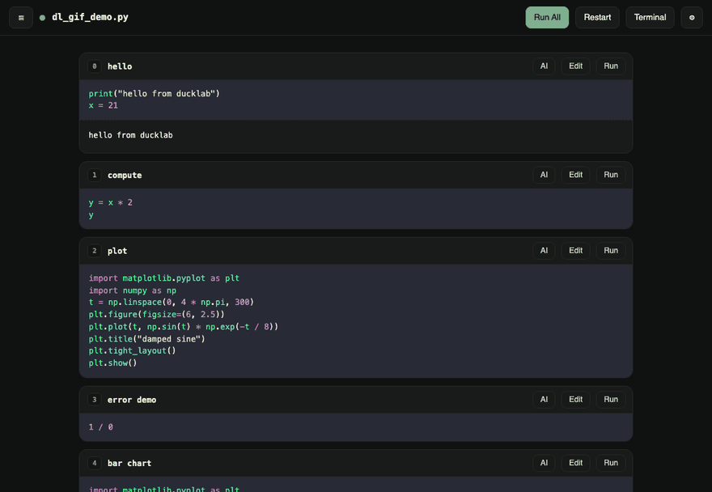
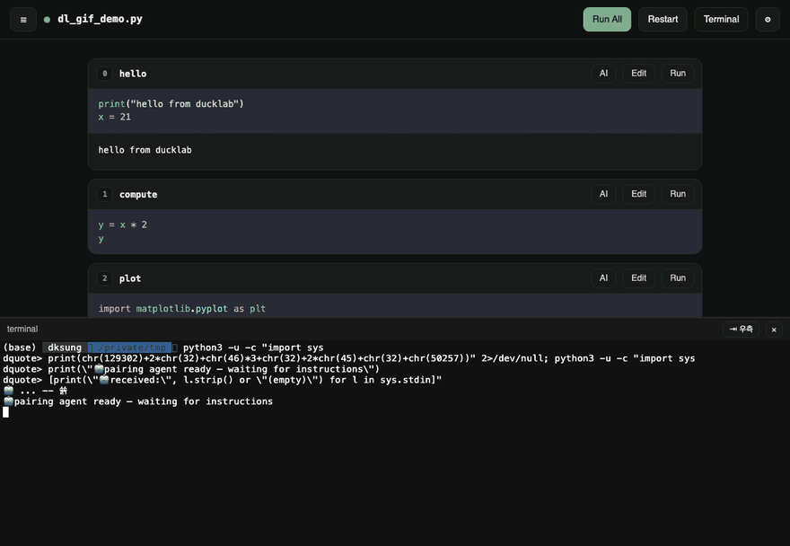
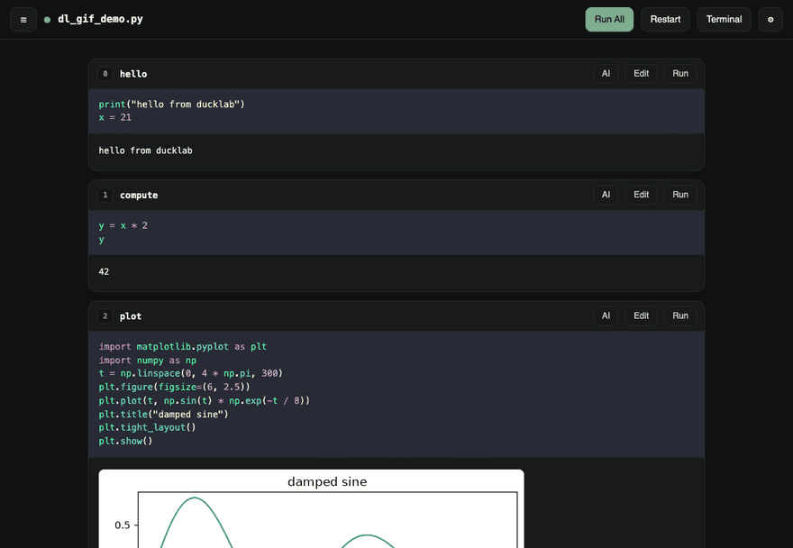

# 🦆 ducklab

**Watch your AI do research.** Plain `.py` files rendered as live notebook cells —
your agent edits the file, the browser updates instantly, and you watch (or jump in)
from any screen, phone included.

```bash
uv run ducklab ~/my/research        # a directory, or a single .py file
# → http://127.0.0.1:8787
```

No `.ipynb`. No cloud. One kernel per file. Claude Code (or any CLI agent) is a
first-class pair partner.

---

### The loop

Run cells, see outputs inline — and when the pairing agent edits the file, the new
cell scrolls into view on its own:



### Point at a cell, tell the AI

Every cell has an **AI** button: type one line, and it lands in the agent's terminal
*with the cell context attached* — no re-describing what you're looking at:



### A workspace, not a file

Browse every `.py` in the project; each opened file gets its **own kernel** (badge =
alive), inspectable and stoppable from the same drawer:



---

## Why

| | Jupyter | marimo | hosted AI notebooks | **ducklab** |
|---|---|---|---|---|
| Source format | `.ipynb` JSON | `.py` | proprietary | **plain `.py` + `# %%`** |
| AI edits the file → UI updates | — | partial | n/a | **yes, live** |
| Your agent (Claude Code, codex, …) | bolt-on | — | their AI only | **built in, auto-started with context** |
| Data stays local | yes | yes | no | **yes** |
| Isolation | kernel per notebook | — | — | **kernel per file** |

The gap ducklab fills: *"my agent is editing research code — I want to watch cells
and plots update live, poke a cell, and answer from my phone, without babysitting a
notebook."*

## Features

- **Live cells from plain `.py`** — `# %%` percent format (jupytext/VS Code
  compatible). Edits on disk re-render instantly; unchanged cells keep their outputs
  (content-hash identity).
- **One kernel per file** — file = one analysis = one namespace. Kernels are lazy,
  listed with pid/memory/last-run, restartable and stoppable per file.
- **Agent built in** — the embedded terminal auto-starts your agent (`claude` by
  default) with a context prompt: which file, how the live loop works, and an HTTP
  API to run cells and read outputs (`/api/cells`, `/api/run/{idx}`,
  `/api/outputs/{idx}`). Prompts are configurable per directory *and per file*.
- **Per-cell AI ask** — one-line instruction, injected into the agent's terminal
  with `cell [idx] "title"` context.
- **Prompt presets** — reusable context snippets as `.ducklab/prompts/*.md`
  (workspace or global `~/.ducklab/prompts/`); import any subset into a file's
  context (e.g. a mid-frequency toolkit + an HFT-features preset), composed on
  top of the base prompt. Selectable per directory or per file.
- **In-browser editing** — CodeMirror per cell (⌘/Ctrl+Enter = save & run); saves
  rewrite only that cell's span on disk, markers preserved, so browser edits and
  agent edits are the same code path: *the file is the truth*.
- **Per-file Python env** — pick the interpreter from a picker (auto-discovered
  `.venv`s + manual paths); kernels launch on that venv's own interpreter via an
  explicit KernelSpec, and ipykernel is provisioned with `uv` if the venv lacks
  it — no preinstall, no kernelspec registration.
- **Real terminal** — xterm + pty, resizable, dockable bottom or **side-by-side**.
- **Workspace browser** — every `.py` in the tree, new-file creation, kernel badges.
- **Syntax highlight** (Dracula in dark), dark/light theme, mobile-friendly
  observation layout.

## Install & run

```bash
git clone https://github.com/dksung94/ducklab && cd ducklab
uv sync
uv run ducklab <file-or-dir>          # default: configured workspace, else cwd
```

Options: `--port`, `--host`, `--term-cmd "codex"` (or `""` for a plain shell).
Settings (⚙): default workspace, agent command, context prompt — directory-level
defaults with optional per-file overrides, stored in `.ducklab.json`.

## Agent API

Everything the browser can do, an agent can do with `curl`:

```bash
curl -s  localhost:8787/api/cells?file=analysis.py            # list cells
curl -sX POST 'localhost:8787/api/run/2?file=analysis.py'     # run cell 2, get outputs
curl -sX POST 'localhost:8787/api/run_all?file=analysis.py'
curl -s  'localhost:8787/api/outputs/2?file=analysis.py'
curl -s  localhost:8787/api/kernels                           # who's alive, which file
```

Runs share the same per-file FIFO queue and kernel as the browser — when the agent
runs a cell, the human sees the output stream in live.

## Security

The terminal + kernel are **arbitrary code execution**. ducklab binds to
`127.0.0.1` by default. For phone access use **Tailscale `serve`** (never `funnel`),
keep an app-level auth in front, and read
[`docs/0001-requirements.md` §5.7](docs/0001-requirements.md) before exposing
anything.

## Status & roadmap

Working today: everything above (M0–M2 of the
[requirements](docs/0001-requirements.md)). Next:

- PEP 723 inline-deps auto-resolution (the manual picker exists today)
- output persistence across server restarts
- kernel idle timeout (manual stop exists)

---

*Sibling of [duckclip](https://github.com/dksung94/duckclip). Built pair-style with
Claude Code — including most of this repo's commits, and the bar-chart cell an agent
added to the demo while we were dogfooding.*
